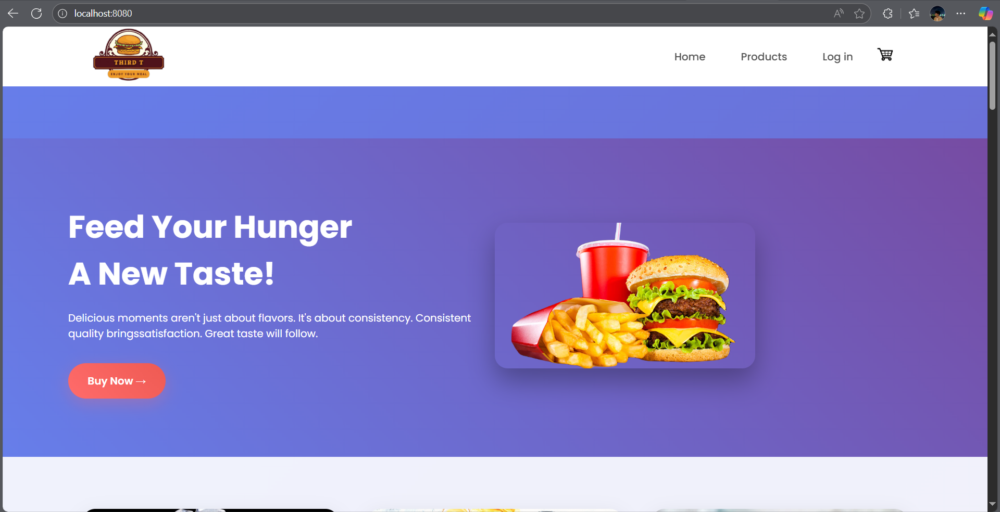
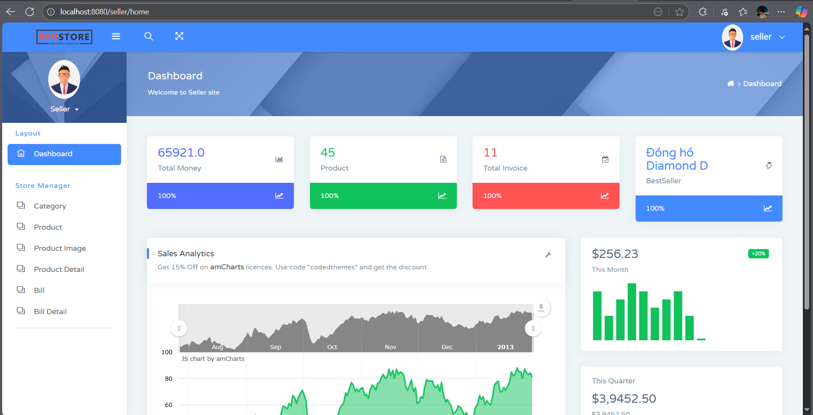
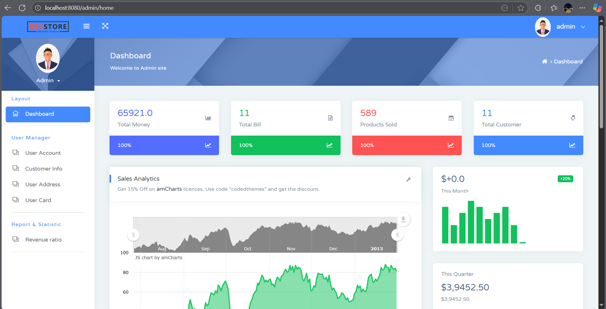

# 🍔 Food Order Web Application

A full-stack food ordering web application built with **Spring Boot**, **Bootstrap (HTML/CSS/JS)**, and **MySQL**. Users can browse menus, place orders, and admins can manage food items, orders, and users.

---

## 📌 Features

### 👥 User
- Register / Login / Logout
- Browse food categories and items
- Add items to cart
- Place orders
- View order history

### 🛠️ Admin
- Manage food categories
- Add/update/delete food items
- Manage orders and users

### 🛒 Seller
- Register and manage seller profile
- Add/update/delete their own food items
- View and manage their orders
- Track sales and earnings

---

## 🧱 Tech Stack

| Layer         | Technology           |
|---------------|----------------------|
| Backend       | Spring Boot, Spring MVC, Spring Data JPA |
| Frontend      | Thymeleaf, Bootstrap 5, HTML/CSS/JS |
| Database      | MySQL                |
| Build Tool    | Maven                |
| ORM           | Hibernate (JPA)      |
| Template      | Thymeleaf            |

---

## 📁 Project Structure

```
food-order/
├── src/
│ ├── main/
│ │ ├── java/com/foodorder/
│ │ │ ├── controller/ # Web controllers
│ │ │ ├── entity/ # JPA entities
│ │ │ ├── repository/ # Spring Data JPA repositories
│ │ │ ├── service/ # Business logic
│ │ │ ├── dto/ # Data Transfer Objects
│ │ │ └── FoodOrderApplication.java
│ │ └── resources/
│ │ ├── static/ # Static files (css, js, images)
│ │ ├── templates/ # Thymeleaf templates
│ │ └── application.properties
├── pom.xml
└── README.md
```

---

## ⚙️ Configuration
### 🛠 `application.properties`
```properties
# MySQL config
spring.datasource.url=jdbc:mysql://localhost:3306/food_order
spring.datasource.username=root
spring.datasource.password=your_password

# JPA settings
spring.jpa.hibernate.ddl-auto=update
spring.jpa.show-sql=true

# Thymeleaf
spring.thymeleaf.cache=false
```

---

## 🧪 How to Run Locally 
### ✅ Prerequisites
- Java 17+
- Maven
- MySQL running locally
- IDE: IntelliJ / VSCode

### 🚀 Steps
```
# Clone project
git clone https://github.com/NSA-TWBlack/FoodOrder.git
cd FoodOrder

# Build project
mvn clean install

# Run Spring Boot
mvn spring-boot:run
```
Visit: http://localhost:8080

---

## 🗃️ Database Setup
### Step 1: Create manually in MySQL
```
CREATE DATABASE food_order CHARACTER SET utf8mb4 COLLATE utf8mb4_unicode_ci;
```
### Step 2: Import data into your database with [Food Order data](food_order.sql)

---

## 🎨 UI & Styling
- Frontend built with Bootstrap 5 for responsive design.
- Static assets in /src/main/resources/static/
- Templates in /src/main/resources/templates/

---

## 🔐 Authentication
- Basic user login/logout using Spring Security (if implemented)
- Role-based access:
  - ROLE_USER: Customer
  - ROLE_ADMIN: Admin dashboard
  - ROLE_SELLER: Seller dashboard

---

## 📸 Screenshots (optional)
Add UI screenshots of:
- User Pages

- Seller Pages

- Admin Pages


---

## 🧹 Development Notes
- Code follows 3-tier architecture: Controller → Service → Repository
- DTOs used for cleaner data transfer
- Reusable components via Thymeleaf fragments

---

## ✅ Todos
- [ ] Add products for food items
- [ ] Payment gateway integration
- [ ] Mobile responsiveness
- [ ] Unit tests for services
- [ ] Upgrade UI

---

## 🤝 Contributing
Contributions are welcome!
### Fork this repo
1. Create your branch: git checkout -b <branch_name>
2. Add your changed files to the staging area: git add .
3. Commit your changes: git commit -m "feat: add something"
4. Push to the branch: git push origin <branch_name>
5. Create a Pull Request
### Some git commands usefully
- See the status of files (create, change, delete)
```
git status
```
- Check commit
```
# Check commit was pushed into remote
git log --oneline

# Check commit was wasn't pushed into remote (just added to staging area)
git log origin <branch_name>..HEAD --oneline
```
- Change to another branch
```
git checkout <branch_name>
```
- Pull code from another branch
```
git pull origin <branch_name>
```
- Create new branch
```
# Create on local
git checkout -b <branch_name>

# Push new branch into remote
git push -u origin <branch_name>
```
- Delete exist branch (note: except 'main' and 'dev')
```
# Delete on local (just branch was merged into another branch)
git branch -d <branch_name>

# Delete on local (forced to delete)
git branch -D <branch_name>

# Delete on remote
git push origin --delete <branch_name>
```
- Reset code to previous commit (used in case remove some commit unnecessary)
```
# Keep the staged
git reset --soft <commit_hash>

# Remove the staged (unstaged)
git reset --mixed <commit_hash>

# Remove all the change (create, update, delete)
git reset --hard <commit_hard>
```
### Rules of commit message writing (usually use)
- Introduces a new feature
  - "feat: add jwt support"
  - "feat!: breaking change in API"
  - "feat!(ui): redesign user profile page"
- Fixes a bug
  - "fix: breaking change in API"
  - "fix(database): resolve data race condition"
- Changes in documentation only
  - "docs: update setup section of README"
- Code changes that do not impact the functionality
  - style(login): correct indentation in login component
- Changes that do not modify the source code or test files, like tweaking the build process or adding dependencies
  - chore: update build script
  - chore(deps): update dependencies

**Note:** Follow the [Commit cheatsheet](https://cheatsheets.zip/conventional-commits) for more usefully commit messages.

---


## 📬 Contact
- Author:
  - Nguyen An Toan
  - Tao Nguyen Van
- Email:
  - antoin2901@gmail.com
  - nvan2903@gmail.com
- GitHub:
  - NSA-TWBlack
  - Tào Nguyên Văn
